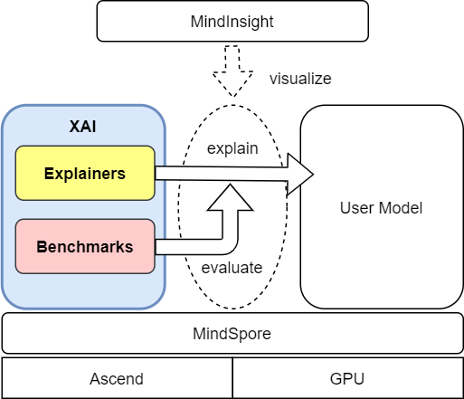
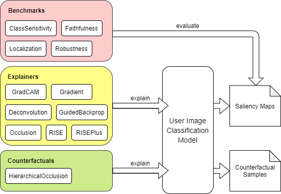

# Explainable AI (XAI)

[查看中文](./README_CN.md)

<!-- TOC --->

- [What is Explainable AI (XAI)](#what-is-explainable-ai-xai)
    - [System Architecture](#system-architecture)
    - [Internal Components](#internal-components)
- [Installation](#installation)
    - [System Requirements](#system-requirements)
    - [Installing by pip](#installing-by-pip)
    - [Installing from Source Code](#installing-from-source-code)
    - [Installation Verification](#installation-verification)
- [Note](#note)
- [Quick Start](#quick-start)
- [Docs](#docs)
- [Community](#community)
    - [Governance](#governance)
- [Contributing](#contributing)
- [License](#license)

<!-- /TOC -->

## What is Explainable AI (XAI)

XAI is an explainable AI toolbox based on [MindSpore](https://www.mindspore.cn/en). Currently, most deep learning models are black-box models with good performance but poor explainability. XAI aims to provide users decision explanations of the model, helps users better understand the model, trust the model, and improve the model when an error occurs. Besides a variety of explanation methods, we also provide a set of evaluation methods to evaluate the explanation methods from various dimensions. It helps users compare and select the explanation methods that are most suitable for a particular scenario.

### System Architecture



### Internal Components



## Installation

### System Requirements

- OS: EulerOS-aarch64, CentOS-aarch64, CentOS-x86, Ubuntu-aarch64 or Ubuntu-x86
- Device: Ascend 910 or GPU CUDA 10.1, 11.1
- Python 3.7.5 or above
- MindSpore 1.4 or above

### Installing by pip

Download the `.whl` package from [MindSpore XAI download page](https://www.mindspore.cn/versions/en) and install with `pip`.

```bash
pip install mindspore_xai-{version}-py3-none-any.whl
```

### Installing from Source Code

1. Download source code from gitee.com:

```bash
git clone https://gitee.com/mindspore/xai.git
```

2. Install the dependency python modules:

```bash
cd xai
pip install -r requirements.txt
```

3. Install the XAI module from source code:

```bash
python setup.py install
```

4. Optionally, you may build a `.whl` package for installation without step 3:

```bash
bash package.sh
pip install output/mindspore_xai-{version}-py3-none-any.whl
```

### Installation Verification

Upon successful installation, importing 'mindspore_xai' module in python will cause no error:

```python
import mindspore_xai
print(mindspore_xai.__version__)
```

## Note

[MindInsight](https://mindspore.cn/mindinsight/en) is an optional tool for visualizing the model explanation from XAI. Please checkout [Tutorials](https://mindspore.cn/mindinsight/docs/en/master/index.html) for more details.

## Quick Start

For a quick start of generating model explanations, please checkout [Tutorials](https://www.mindspore.cn/xai/docs/en/master/index.html).

## Docs

For more details about installation, tutorials and APIs, please checkout [Front Page](https://www.mindspore.cn/xai/en).

## Community

### Governance

Checkout how MindSpore Open Governance [works](<https://gitee.com/mindspore/community/blob/master/governance.md>)

## Contributing

Welcome contributions. See our [Contributor Wiki](https://gitee.com/mindspore/mindspore/blob/master/CONTRIBUTING.md) for more details.

## License

[Apache License 2.0](LICENSE)
