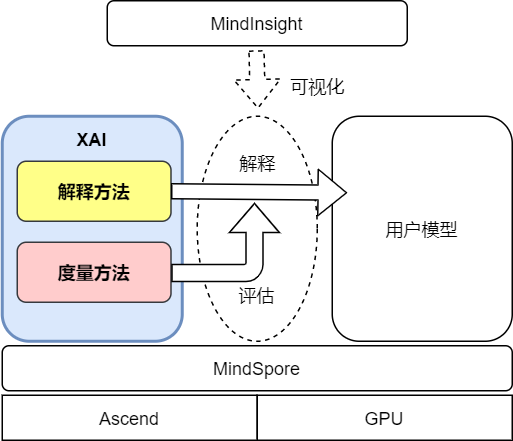
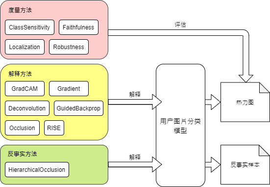

# 可解释AI (XAI)

[View English](./README.md)

<!-- TOC --->

- [什么是可解释AI (XAI)](#什么是可解释ai-xai)
    - [系统架构](#系统架构)
    - [内部组件](#内部组件)
- [安装教程](#安装教程)
    - [系统要求](#系统要求)
    - [pip安装](#pip安装)
    - [从源码安装](#从源码安装)
    - [验证是否安装成功](#验证是否安装成功)
- [注意事項](#注意事項)
- [快速入门](#快速入门)
- [文档](#文档)
- [社区](#社区)
    - [治理](#治理)
- [贡献](#贡献)
- [许可证](#许可证)

<!-- /TOC -->

## 什么是可解释AI (XAI)

XAI是一个基于 [MindSpore](https://www.mindspore.cn/en) 的可解释AI工具箱。当前深度学习模型多为黑盒模型，性能表现好但可解释性较差。XAI旨在为用户提供对模型决策依据的解释，帮助用户更好地理解模型、信任模型，以及当模型出现错误时有针对性地改进模型效果。除了提供多种解释方法，还提供了一套对解释方法效果评分的度量方法，从多种维度评估解释方法的效果，从而帮助用户比较和选择最适合于特定场景的解释方法。

### 系统架构



### 内部组件



## 安装教程

### 系统要求

- 操作系统: EulerOS-aarch64、CentOS-aarch64、CentOS-x86、Ubuntu-aarch64 或 Ubuntu-x86
- 硬件平台: Ascend 910 或 GPU CUDA 10.1、11.1
- Python 3.7.5 或以上
- MindSpore 1.4 或以上

### pip安装

从[MindSpore XAI下载页面](https://www.mindspore.cn/versions)下载并安装whl包。

```bash
pip install mindspore_xai-{version}-py3-none-any.whl
```

### 从源码安装

1. 从gitee.com下载源码：

```bash
git clone https://gitee.com/mindspore/xai.git
```

2. 安装所有依赖的Python包：

```bash
cd xai
pip install -r requirements.txt
```

3. 从源码安装XAI：

```bash
python setup.py install
```

4. 你也可以跳过第三步，打包一个`.whl`安装包:

```bash
bash package.sh
pip install output/mindspore_xai-{version}-py3-none-any.whl
```

### 验证是否安装成功

成功安装后，在Python运行以下代码会印出已安装的XAI版本：

```python
import mindspore_xai
print(mindspore_xai.__version__)
```

## 注意事項

[MindInsight](https://gitee.com/mindspore/mindinsight/blob/master/README.md) 是一个可选的XAI可视化工具，请参阅[使用教程](https://www.mindspore.cn/en)。

## 快速入门

关于如何快速使用XAI为模型进行解释，请点击查看XAI[使用教程](https://www.mindspore.cn/xai/docs/zh-CN/master/index.html)。

## 文档

有关安装指南、教程和API的更多详细信息，请参阅[首頁](https://www.mindspore.cn/xai)。

## 社区

### 治理

查看MindSpore如何进行[开放治理](https://gitee.com/mindspore/community/blob/master/governance.md)。

## 贡献

欢迎参与贡献。更多详情，请参阅我们的[贡献者Wiki](https://gitee.com/mindspore/mindspore/blob/master/CONTRIBUTING.md)。

## 许可证

[Apache License 2.0](LICENSE)
